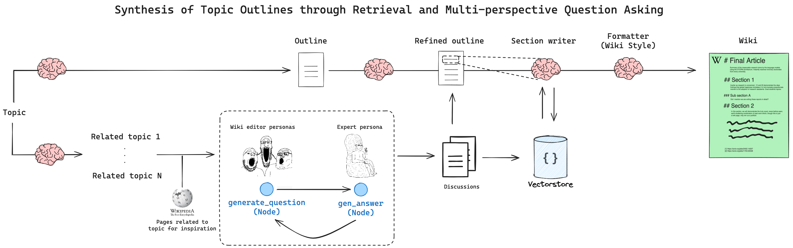

</img>

## STORM - LangChain
Implementation of <a href="https://arxiv.org/abs/2402.14207">Assisting in Writing Wikipedia-like Articles From Scratch with Large Language Models</a>, in LangChain.

It is a writing system for the Synthesis of Topic Outlines through Retrieval and Multi-perspective Question Asking. STORM models the pre-writing stage by discovering diverse perspectives in researching the given topic, simulating conversations where writers carrying different perspectives pose questions to a topic expert grounded on trusted Internet sources, curating the collected information to create an outline.
